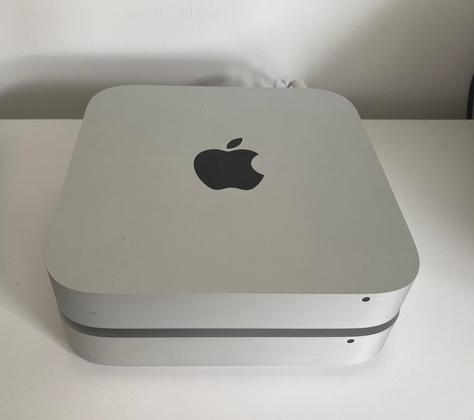

# 🏠 Homelab: Mac minis + K3s + Debian

> Live view of the active pods on my cluster: [homelab.stansyfert.com](https://homelab.stansyfert.com)
>
> ⚠️ Might be down or buggy since I'm actively working on it.

A lightweight Kubernetes homelab setup running on 2x repurposed Apple Mac mini hardware.
This homelab setup provides a cost-effective way to freely explore Kubernetes features.

## Projects

- [Portal](projects/portal/README.md)
    - Simple WebUI with read access to cluster
    - SvelteKit + Kubernetes RBAC
- [GitOps CI/CD](projects/gitops/README.md)
    - Deploy to projects based on Git repository
    - ArgoCD, GitHub Actions, Kustomize, Docker Hub
- [Cloudflare Tunnel](projects/cloudflare-tunnel/README.md)
    - Tunnels through to my K3s server
    - Forwards traffic to Service, currently used for the Portal
- [Observability](projects/observability/README.md)
    - Getting insight into pod logs a la Azure Application Insight
    - Fluent Bit + Loki + Grafana
- [Container Registry](projects/container-registry/README.md)
    - Self hosted container registry
- [Tailscale VPN](projects/tailscale/README.md)
    - Basic VPN for remote `kubectl` access to cluster
    - Exposing Argo CD with MagicDNS domain name
- [Proxmox VE](projects/proxmox/README.md)
    - More nodes for the cluster
    - Virtual router with BGP support
    - Setup networking for nodes
    - Setup failover for nodes

## Next steps

- MetalLB
    - Replace the built-in ServiceLB of K3s
    - Closer to a production setup
    - Start of with Layer 2 mode
    - Move on to BGP mode after (requires extra node and router setup)
- Elastic Stack
    - Export Fluentbit data to Elasticsearch + Kibana
- Autoscaling pods based on activity
    - Demo via interactive UI on My Portal
- Kafka API implementation with Redpanda

## Experiments

- [Woodpecker](projects/woodpecker/README.md)
    - Alternative to GitHub Actions
    - Can run on my cluster
    - Has some issues with privileged mode permissions
- Gitea
    - [About Gitea](https://gitea.io/)
    - Source code management
    - Has pipeline support using `act`
    - The Helm chart were not up to date, as it still uses Bitnami's Debian based images

## Hardware

### Control Node

| Component | Specification |
|-----------|---------------|
| **Machine** | Apple Mac mini Mid 2014 (Model A1347) |
| **RAM** | 4 GB |
| **Storage** | Internal 500GB HDD |

### Worker Node

| Component | Specification |
|-----------|---------------|
| **Machine** | Apple Mac mini Late 2012 (Model A1347) |
| **RAM** | 2 GB + 4 GB |
| **Storage** | Internal 500GB HDD |

Both machines run K3s on headless Debian 13.

## Networking

Both machines are connected to the same network via Ethernet.
The router is providing static IP addresses to the machines.
The router also provides DNS resolution for the machines.

Both machines are reachable via SSH, enabling `kubectl` access from another machine on the same LAN.
