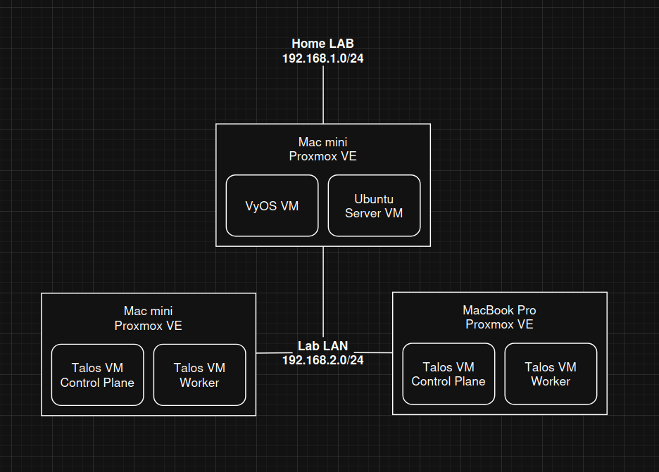

# Homelab — Intel Macs · Fedora CoreOS · k3s · VyOS

> A chronological log of what was built, what broke, and what was learned:
> [homelab.stansyfert.com/journal](https://homelab.stansyfert.com/journal)

This repository documents a **production-inspired Kubernetes homelab** built to explore platform engineering, networking, GitOps, and cluster operations at a realistic depth. The focus is on operating Kubernetes the way it runs in real systems: explicit infrastructure, immutable OSes, declarative configuration, and BGP-based load balancing.

---

## Hardware

| Machine | Role | OS |
|---------|------|----|
| macmini0 | Proxmox VE host (router/firewall VM) | Proxmox VE |
| macmini1 | k3s control plane | Fedora CoreOS |
| mbp | k3s worker node | Fedora CoreOS |

---

## Architecture

### Network

The lab runs on an isolated **Lab LAN (192.168.2.0/24)**, separated from the home network.

- **VyOS** runs as a Proxmox VM on macmini0, acting as router, DHCP server, NAT gateway, and DNS forwarder
- **eBGP peering**: VyOS (AS 64513) peers with k3s nodes (AS 64512) via FRR
- **MetalLB BGP speakers** on each node advertise LoadBalancer IPs to VyOS, which installs them as host routes — no ARP or L2 magic
- **Tailscale** on VyOS advertises the Lab LAN subnet (`192.168.2.0/24`), enabling full remote access without a jump host

### Kubernetes

- **Distribution**: k3s (ServiceLB disabled; MetalLB handles LoadBalancer IPs)
- **CNI**: OVN-Kubernetes in local gateway mode, with EgressService support for deterministic egress routing
- **Load balancing**: MetalLB BGP mode, IP pool `192.168.2.110–192.168.2.200`
- **Ingress**: Traefik (deployed via Helm/Terraform)

### Node Provisioning

Kubernetes nodes run **Fedora CoreOS** on bare metal, provisioned declaratively:

1. Write machine config in **Butane YAML** (hostname, SSH keys, systemd units, network, packages)
2. Transpile to **Ignition JSON** using the Butane container image
3. Serve the `.ign` file over HTTP; install with `coreos-installer --ignition-url`
4. Sensitive fields in Butane configs encrypted at rest with **SOPS + age**

---

## Platform Stack

| Component | Purpose | Deployed via |
|-----------|---------|--------------|
| k3s | Kubernetes distribution | systemd service on CoreOS nodes |
| OVN-Kubernetes | CNI — pod networking, egress control | Helm (from upstream repo) |
| MetalLB (BGP) | LoadBalancer IP assignment | `kubectl apply` |
| Traefik | HTTP/HTTPS ingress | Helm (Terraform) |
| Argo CD | GitOps continuous delivery | `kubectl apply` |
| GitHub Actions | CI — build, push, tag | Workflows in repo |
| Kustomize | Manifest templating (image tags) | Used by Argo CD |
| Fluent Bit + Loki + Grafana | Log aggregation and visualization | Helm |
| Cloudflare Tunnel | Secure external ingress | `cloudflared` Deployment |
| Tailscale | Encrypted remote access + MagicDNS | VyOS plugin + k8s operator |
| Docker Registry | Self-hosted container registry | Deployment + PVC |
| Portal | Read-only cluster UI (SvelteKit + RBAC) | Docker Hub → Argo CD |
| SOPS + age | Secret encryption for infra configs | CLI + `.sops.yaml` rules |
