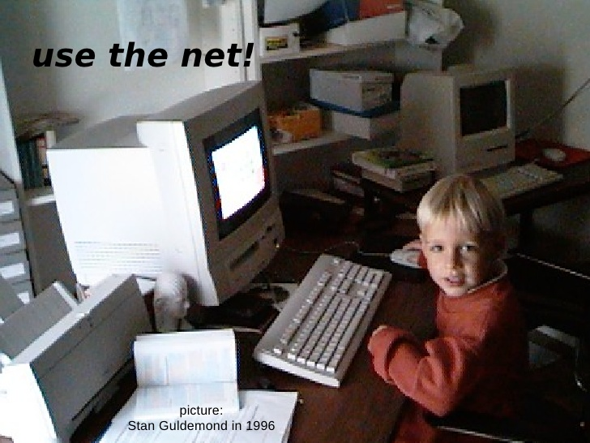

# my homelab

(04-05-2026)

oh man, i just wrote such a boring blog entry about my homelab. i mean, its not that boring per se, i like my homelab, but its just summing up all the technical aspects of it. an llm could do that better! what even could i tell about my homelab, without falling in the trap of boring myself again.

well, working on it excites me. its not even doing much at the moment, its all 2012 era intel based mac hardware, so very underpowered. but thats the beauty of my field of engineering, i'm not per se limited by compute power. these machines run linux so well, everything is supported, they can even do some minimal virtualization. i have a vyos route creating a separate lan subnet, behind that a k3s cluster. i'm trying out all kinds of cool stuff. i'm serving a ignition/butane file over lan to when installing coreos on them, so i can super easily reinstall them. next i want to try out [bootc](https://bootc.dev/).

on the k3s cluster i have [ovn-kubernetes](https://ovn-kubernetes.io/) as cni, which has no business there, but it runs! i can do the entire package trace across the ovn/ovs stack and learn so much about its inner workings. i'm deploying my [custom operator](https://github.com/sguldemond/flightradar) on there as well.

o no, i'm making it a listing of all the technical aspects, i better stop before i bore myself again. its weird, i like working on it, but writing about its technical aspects bores me. i wouldn't be that bored reading about someone elses setup i suppose. but i guess it just not the type of writing that i'm after. still figuring this one out very much.

maybe i just like having the excitement for computing back. looking for an excuse to post this picture of me behind a kid behind a macintosh performa, clicking around, same me, same fascination:

(i changed my last name from Guldemond to Syfert when i got married)