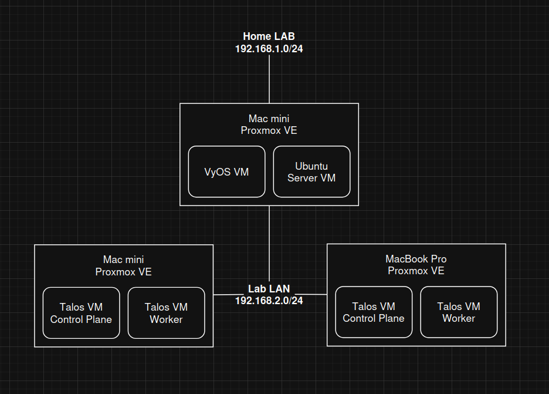

# Homelab

> **Live cluster view:** [https://homelab.stansyfert.com](https://homelab.stansyfert.com)
>
> *(may be unstable — this lab is under active development.)*

This repository documents my **production-inspired Kubernetes homelab**, built to explore **platform engineering, networking, GitOps, and cluster operations** in a realistic environment.

The goal is not experimentation for its own sake, but **operating Kubernetes the way it's run in real systems**: explicit infrastructure, minimal OSes, declarative configuration, and recoverable failure modes.

## 🧱 Infrastructure (Core Focus)

### Hypervisor

**Proxmox VE**

* Primary hypervisor for the lab
* Hosts all infrastructure VMs:

  * Talos Linux (Kubernetes control plane & workers)
  * VyOS (router / firewall)
  * Ubuntu Server (management & Tailscale exit node)

---

### Kubernetes Platform

**Talos Linux on Proxmox**

* Kubernetes cluster running on **immutable, API-driven Linux**
* No SSH or shell access by default
* Control plane and worker nodes as VMs
* Configuration managed entirely via Talos machine configs
* **MetalLB** (Layer 2 mode) and **Traefik** manually installed via Helm/Terraform

This setup enforces:

* Declarative thinking
* Strong separation between OS, platform, and workloads
* Safe rebuilds and reproducible nodes

---

### Networking & Edge

**VyOS (Proxmox VM)**

* Edge router and firewall for the lab
* NAT (masquerade) for outbound traffic
* DHCP (Kea) for the Lab LAN
* Stateful firewall rules
* DNS forwarding

**Lab LAN**

* Seperated from my "Home LAN" network
* Subnet: **192.168.2.0/24**
* Gateway: **192.168.2.1**
* All VMs obtain addresses via DHCP
* Talos nodes rely on stable network identity for cluster bootstrapping

Networking is intentionally **explicit and predictable** — no hidden defaults or UI magic.

---

### Secure Access

**Tailscale**

* Ubuntu Server VM acts as:
  * Management node
  * Tailscale exit node
* Enables:
  * Secure remote `kubectl` access
  * MagicDNS access to internal services (e.g. Argo CD)
  * Safe connectivity during firewall or routing changes (no lockouts)

## ⚙️ Platform Capabilities

Rather than isolated "projects", the cluster is operated as a **cohesive platform**:

* **GitOps CI/CD**

  * Argo CD, GitHub Actions, Kustomize
* **Ingress & Load Balancing**

  * Traefik
  * MetalLB (Layer 2, migrating toward BGP)
* **Observability**

  * Fluent Bit, Loki, Grafana
* **Registry**

  * Self-hosted container registry
* **Secure Exposure**

  * Cloudflare Tunnel
* **Cluster UI**

  * Custom read-only portal (SvelteKit + RBAC)

Each component is installed and maintained manually or declaratively — no "click-ops".

## 🔬 Ongoing Work & Next Steps

* MetalLB **BGP mode** for higher availability
* Autoscaling workloads driven by real usage
* Kafka-compatible messaging with **Redpanda**
* Extended observability (Elastic stack)

These changes are evaluated for **operability**, not just feature coverage.

## 🧪 Experiments (Secondary)

* Woodpecker CI (self-hosted pipelines)
* Gitea (SCM + pipelines)

Used selectively to compare trade-offs against managed tooling.

## 🎯 What this lab demonstrates

* End-to-end Kubernetes platform ownership
* Networking beyond "Kubernetes-only" abstractions
* Immutable infrastructure patterns
* GitOps and declarative operations
* Failure-aware design and recovery paths
* Comfort operating without safety nets (SSH, UI firewalls, etc.)
