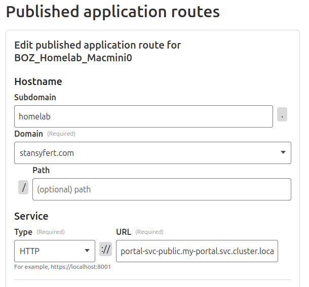

# Cloudflare Tunnel

Easy way to expose Services to the internet.
Based on the excellent documentation by Cloudflare: [Cloudflare Tunnel for Kubernetes](https://developers.cloudflare.com/cloudflare-one/connections/connect-networks/deployment-guides/kubernetes/)

Redirects directly to a Service within my cluster:

