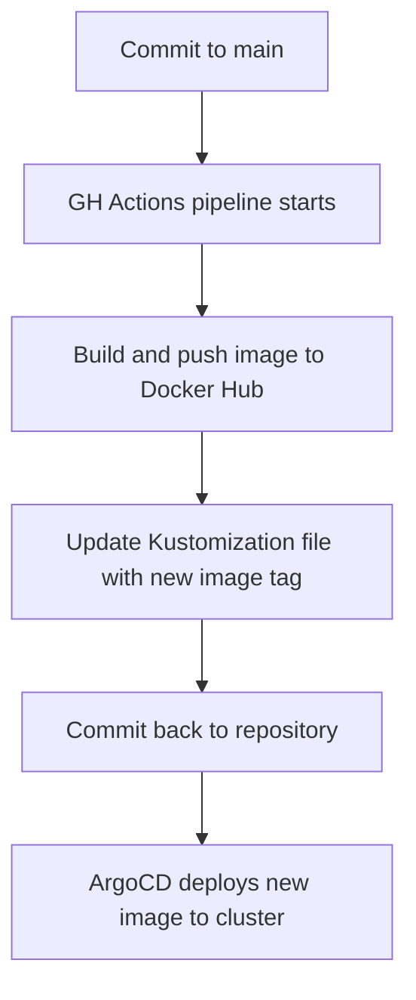

# GitOps CI/CD

Deploy to projects based on Git repository.
When committing to `main` branch, GitHub Actions pipeline builds portal image and pushes it to Docker Hub.
After the same pipeline updates the Kustomization file with the new image tag, and commits it back to the repository.
ArgoCD will then deploy the new image to the cluster.

Stack:
- ArgoCD
- GitHub Actions
- Kustomize
- Docker Hub
