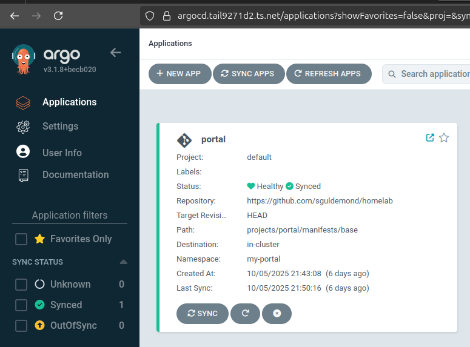

# Tailscale

I use Tailscale to connect to my machines remotely.
I can also expose services to my Tailnet network.
Also very useful when reconfiguring the network and not lose SSH connection.

## MagicDNS

With their Kubernetes Uperator I expose services to my other devices connected to the Tailscale network.

For example the Argo CD server via an [Ingress resource](../../projects/gitops/argocd/tailscale-ingress.yaml).

